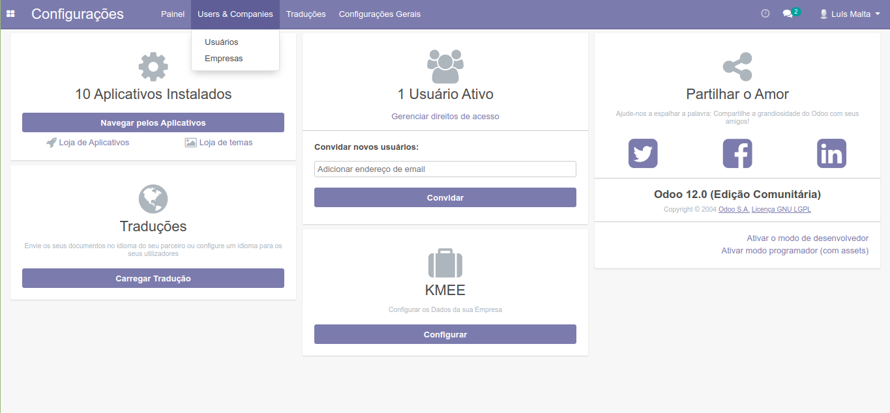
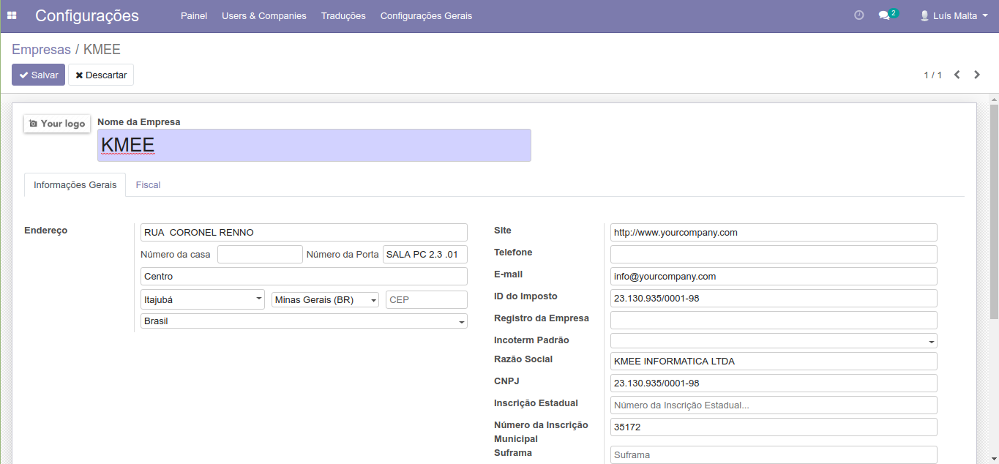
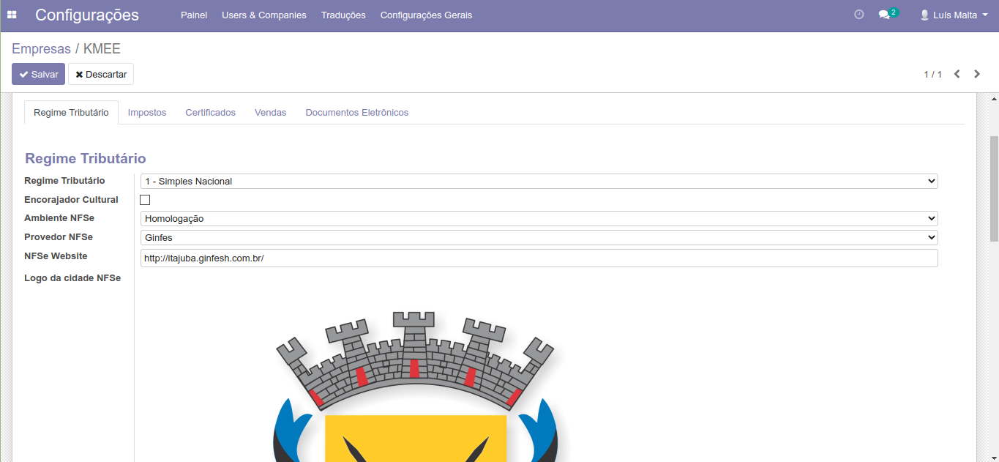
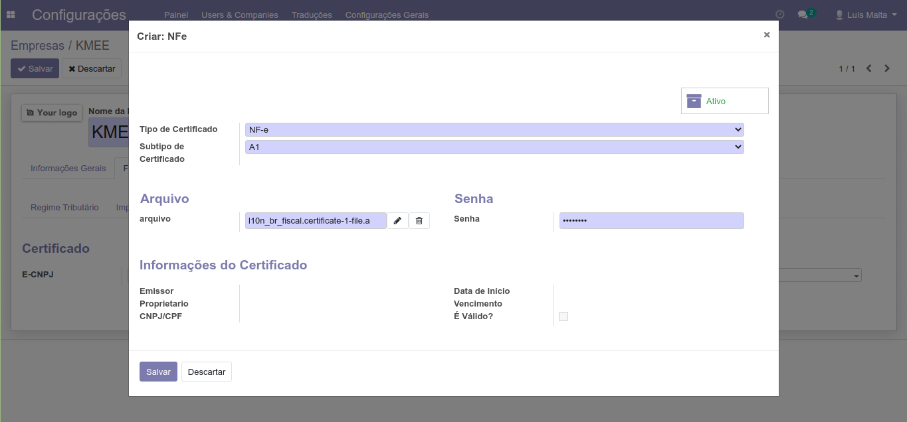
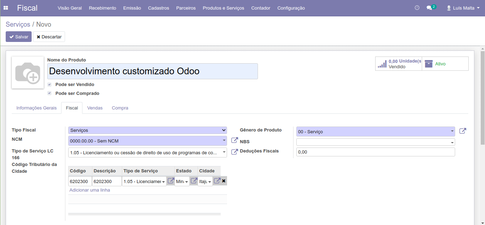
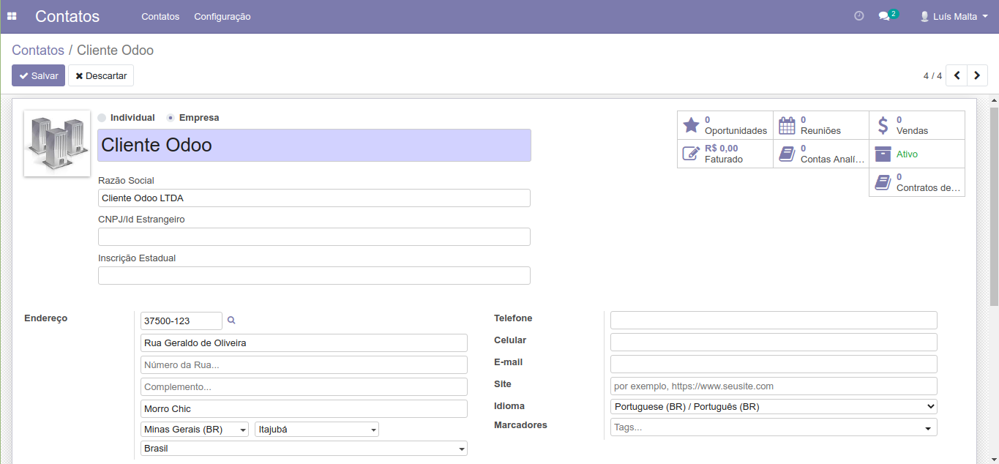
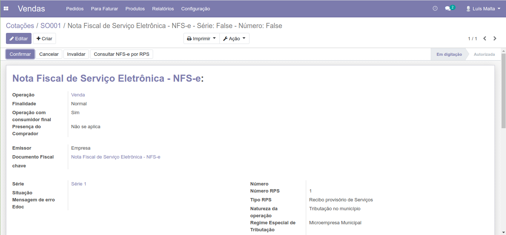

Configurar a empresa
--------------------
A configuração dos dados da empresa é feita no módulo de Configurações,
acessando o sub menu `Empresas` no menu `Usuários & Empresas`.

Selecione sua empresa na lista e clique em Editar no canto superior esquerdo
do formulário.

Na aba `Informações Gerais` preencha as seguintes informações de sua empresa:

- Endereço
- Razão Social
- CNPJ
- Inscrição Municipal

Navegue para a aba `Fiscal` e na sub aba `Regime Tributário` preencha as seguintes informações:

- Ambiente NFSe
- NFSe Website
- Logo da cidade NFSe

Na sub aba `Certificados` clique no campo `NFe` e selecione `Criar e Editar...`.
Na janela assistente que se abrirá, faça o upload do arquivo pfx,
adicione sua senha e clique no botão `Salvar`.

Salve as alterações realizadas na sua empresa.

Criar um novo serviço
---------------------

No módulo `Fiscal`, clique no menu `Produtos e Serviços` e acesse o sub menu `Serviços` e clique em `Criar`.

Preencha o nome do serviço em `Nome do Produto`.

Na aba Fiscal selecione o `Tipo de Serviço LC 166`.
e no campo `Código Tributário da Cidade` adicione uma linha e preencha as
informações de acordo com seu serviço.

Salve o serviço.

Configurar um cliente
---------------------

Acesse o módulo `Contatos` e clique em `Criar`.

Preencha o `Nome` do cliente e selecione se ele é um `Individual ou Empresa`.

Preencha os campos:
- Razão Social
- Endereço
- Idioma

Na aba Fiscal selecione o `Perfil Fiscal de Parceiro`.

Salve o cliente.

Criar uma venda
---------------

Acesse o módulo `Vendas` clique em `Criar` para abrir o formulário para criar
uma nova Cotação.

No campo `Cliente` selecione um cliente previamente criado ou crie um clicando 
em `Criar e Editar...`.

Na lista da aba `Itens do Pedido` clique em `Adicionar produto`. 
No assistente que se abrirá selecione o serviço no campo `Produto` e preencha os 
campos `Quantidade` e `Preço Unitário`.

Na sub aba `ISSQN`  da aba `Impostos` selecione uma opção para o campo `Imposto ISSQN`.
Clique em `Salvar & Sair`.

